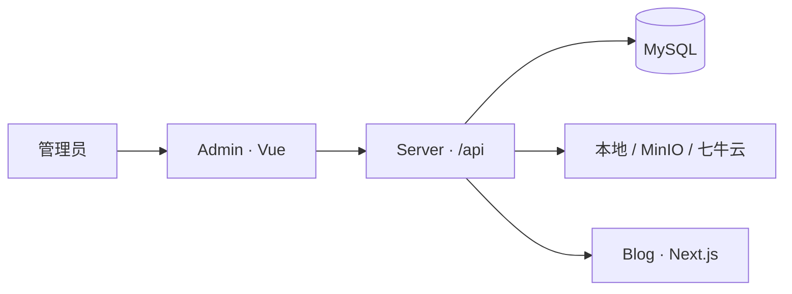

# My House · 生活档案馆管理后台（Admin）

My House 三端项目的内容管理后台，用于集中维护文章、影像、生活记录、访客反馈、文件和站点配置。


## 项目预览

<!--
将后台首页截图保存为 docs/images/dashboard.png 后，用下面这行替换截图占位：

-->

<div align="center">
  <br />
  <strong>📷 截图占位 · 后台仪表盘</strong>
  <br />
  <sub>建议尺寸：1600 × 900</sub>
  <br /><br /><br />
</div>

<!--
将内容编辑截图保存为 docs/images/content-editor.png 后，用下面这行替换截图占位：

-->

<div align="center">
  <br />
  <strong>📷 截图占位 · 内容编辑界面</strong>
  <br />
  <sub>建议展示文章编辑或站点配置页面</sub>
  <br /><br /><br />
</div>

## 三端组成

| 项目 | 职责 | 仓库 |
| --- | --- | --- |
| Blog | 面向访客的博客与生活档案前台 | [spring_blogs](https://github.com/RRTiamo/spring_blogs) |
| Admin | 内容与站点配置管理后台 | **当前仓库** |
| Server | API、鉴权、数据库与文件存储 | [spring_server](https://github.com/RRTiamo/spring_server) |



## 主要功能

- 登录状态与 Sa-Token 会话管理
- 仪表盘与内容概览
- 文章、分类、照片墙、随笔便签和成就管理
- 恋爱记录、愿望清单、时间胶囊和岁月信箱管理
- “此时此刻”、关于作者、友情链接和页面可见性配置
- 鱼塘反馈审核、回复、标签与状态管理
- 本地、MinIO、七牛云文件的统一管理入口
- 品牌、主题、备案、地图、AI、数据库和存储配置

## 技术栈

- Vue 3 + TypeScript
- Vite 6
- Vue Router + Pinia
- Naive UI + UnoCSS
- Axios
- ECharts、Leaflet、GSAP

## 本地运行

### 环境要求

- Node.js 20 LTS 或 Node.js 22+
- npm
- 已启动的 [spring_server](https://github.com/RRTiamo/spring_server)，默认地址为 `http://localhost:8080`

### 1. 获取项目

```bash
git clone https://github.com/RRTiamo/spring_admin.git
cd spring_admin
npm ci
```

### 2. 配置开发环境

项目根目录创建或修改 `.env.development`：

```dotenv
# 浏览器端使用的 API 基础路径。
VITE_API_BASE_URL=/api

# Vite 开发代理的 Server 地址，不包含 /api。
VITE_DEV_API_TARGET=http://localhost:8080
```

### 3. 启动

```bash
npm run dev
```

访问终端输出的本地地址，通常为 [http://localhost:5173](http://localhost:5173)。

> [!IMPORTANT]
> 后台账号由 Server 的 `APP_ADMIN_USERNAME` 与 `APP_ADMIN_PASSWORD` 提供。服务端没有默认密码，启动 Server 前必须显式设置。

## 环境变量

| 变量 | 用途 | 开发环境建议值 |
| --- | --- | --- |
| `VITE_API_BASE_URL` | 浏览器端 API 基础路径，会写入构建产物 | `/api` |
| `VITE_DEV_API_TARGET` | Vite 开发服务器的代理目标 | `http://localhost:8080` |

如果生产环境使用同域反向代理，保留 `VITE_API_BASE_URL=/api` 即可；如果 API 位于独立域名，应填写完整 HTTPS 地址并重新构建。

## 可用命令

| 命令 | 说明 |
| --- | --- |
| `npm run dev` | 启动 Vite 开发服务器 |
| `npm run lint` | 运行 `vue-tsc` 类型检查 |
| `npm run build` | 类型检查并构建至 `dist/` |
| `npm run preview` | 本地预览生产构建 |

提交前至少运行：

```bash
npm run lint
npm run build
```

## 目录结构

```text
src/
├─ api/          # 统一 API 请求与接口封装
├─ assets/       # 后台静态资源
├─ components/   # 可复用组件
├─ icon/         # 菜单及业务图标配置
├─ interface/    # 核心 TypeScript 类型
├─ mock/         # 静态兜底数据
├─ router/       # 页面路由与登录守卫
├─ store/        # Pinia 状态
└─ views/        # 各业务管理页面
```

## 生产部署

```bash
npm ci
npm run build
```

将 `dist/` 作为静态站点发布，并为 SPA 路由配置回退到 `index.html`。同时确认：

1. `/api` 已反向代理到 Server，或 `VITE_API_BASE_URL` 已指向完整 API 地址。
2. Admin 与 Server 使用 HTTPS。
3. Server 的 CORS 白名单只包含真实的 Blog/Admin 域名。
4. 默认管理员凭据已更换，敏感配置未进入 Git。

## 开源与安全检查

- 不要提交数据库密码、AI Key、对象存储密钥或生产 Token。
- Vite 的 `VITE_*` 变量会进入浏览器构建产物，只能存放公开配置。
- 检查 `public/`、Mock 数据及表单默认值，移除个人信息和无授权素材。
- 生产环境应限制后台访问入口，并在反向代理层启用 HTTPS、安全响应头和访问日志。

## 参与贡献

欢迎通过 Issue 或 Pull Request 参与改进。新增网络请求、核心类型、Mock 数据和图标时，请继续放在对应的 `api/`、`interface/`、`mock/` 与 `icon/` 目录中。

## 许可证

当前仓库尚未附带开源许可证。在仓库根目录补充明确的 `LICENSE` 前，代码默认保留全部权利。
